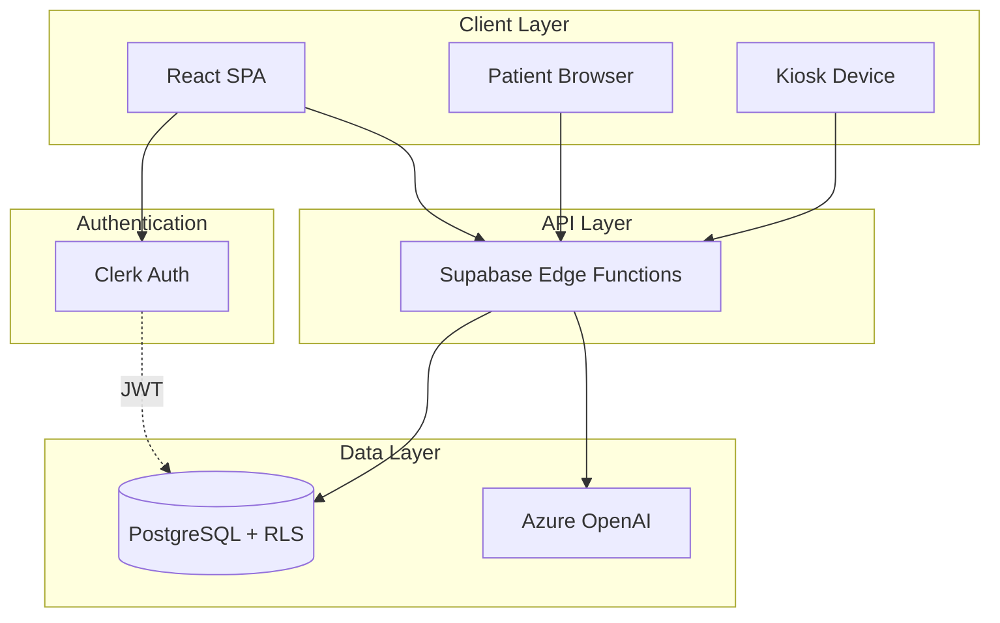
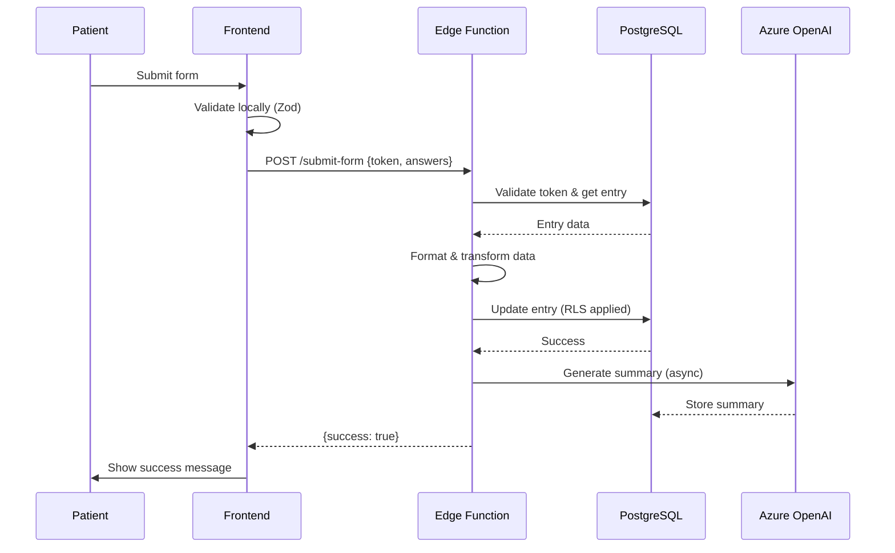
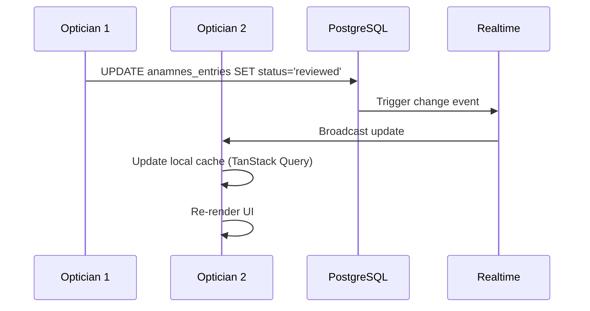

# System Architecture

This document provides an in-depth look at the architectural decisions, patterns, and design philosophy behind the Optician Anamnesis System.

## Table of Contents
- [High-Level Architecture](#high-level-architecture)
- [Frontend Architecture](#frontend-architecture)
- [Backend Architecture](#backend-architecture)
- [Data Flow](#data-flow)
- [Security Architecture](#security-architecture)
- [State Management Strategy](#state-management-strategy)
- [Form System Design](#form-system-design)
- [Real-time Features](#real-time-features)
- [Performance Considerations](#performance-considerations)

## High-Level Architecture



### Design Principles

1. **Security First**: Every data access goes through RLS policies
2. **Type Safety**: Full TypeScript coverage from DB to UI
3. **Separation of Concerns**: Clear boundaries between layers
4. **Progressive Enhancement**: Works on all devices, optimized for each
5. **GDPR by Design**: Compliance built into every feature

## Frontend Architecture

### Component Hierarchy

```
App
├── Layout (with Clerk authentication)
│   ├── Navbar (role-based navigation)
│   └── AppSidebar (context-aware menu)
├── ProtectedRoute (auth guard)
│   ├── RoleGuard (role-based access)
│   └── Page Components
│       ├── PatientFormPage
│       │   └── FormOrchestrator
│       │       └── FormContextProvider
│       │           ├── FormLayout
│       │           ├── SingleQuestionLayout (kiosk)
│       │           └── FormFieldRenderer
│       ├── OpticianView
│       │   ├── AnamnesisListView
│       │   └── AnamnesisDetailModal
│       └── AdminPanel
│           ├── FormBuilder
│           └── SystemSettings
```

### Component Design Patterns

#### 1. Container/Presentational Split
```typescript
// Container (logic)
export const FormOrchestratorContainer = ({ formId }) => {
  const { data, isLoading } = useFormTemplate(formId);
  const { submitForm } = useFormSubmission();
  
  if (isLoading) return <LoadingState />;
  
  return <FormOrchestrator formTemplate={data} onSubmit={submitForm} />;
};

// Presentational (UI)
export const FormOrchestrator = ({ formTemplate, onSubmit }) => {
  return (
    <FormContextProvider formTemplate={formTemplate} onSubmit={onSubmit}>
      <FormLayout />
    </FormContextProvider>
  );
};
```

#### 2. Custom Hooks for Business Logic
```typescript
// useFormSubmission.ts - Encapsulates all submission logic
export const useFormSubmission = () => {
  const [isSubmitting, setIsSubmitting] = useState(false);
  const supabase = useSupabaseClient();
  
  const submitForm = async (token: string, values: Record<string, any>) => {
    setIsSubmitting(true);
    try {
      const { data, error } = await supabase.functions.invoke('submit-form', {
        body: { token, answers: values }
      });
      // Handle response...
    } finally {
      setIsSubmitting(false);
    }
  };
  
  return { submitForm, isSubmitting };
};
```

#### 3. Context for Complex State
```typescript
// FormContext.tsx - Manages form state across many components
export const FormContextProvider = ({ children, formTemplate, onSubmit }) => {
  const form = useForm({ defaultValues: initialValues });
  const [currentSection, setCurrentSection] = useState(0);
  
  const value = {
    form,
    formTemplate,
    currentSection,
    setCurrentSection,
    onSubmit: form.handleSubmit(onSubmit)
  };
  
  return <FormContext.Provider value={value}>{children}</FormContext.Provider>;
};
```

### Routing Strategy

```typescript
// Routes are organized by user role and authentication status
<Routes>
  {/* Public routes */}
  <Route path="/patient/:token" element={<PatientFormPage />} />
  <Route path="/kiosk/:persistentToken" element={<KioskWelcomePage />} />
  
  {/* Protected routes (require Clerk auth) */}
  <Route element={<ProtectedRoute />}>
    <Route path="/dashboard" element={<OpticianView />} />
    
    {/* Admin-only routes */}
    <Route element={<RoleGuard allowedRoles={['admin']} />}>
      <Route path="/admin" element={<AdminPanel />} />
    </Route>
  </Route>
</Routes>
```

## Backend Architecture

### Edge Functions Design

Edge functions are single-responsibility serverless functions that handle:
1. **Authentication bypass** (token validation)
2. **Business logic** (data transformation, validation)
3. **External API calls** (Azure OpenAI)
4. **Database operations** (via Supabase client)

#### Edge Function Structure

```
supabase/functions/
├── submit-form/
│   ├── index.ts              # Main handler
│   ├── types.ts              # TypeScript types
│   ├── tokenValidation.ts    # Token verification logic
│   ├── databaseOperations.ts # DB queries
│   ├── dataFormatting.ts     # Data transformation
│   └── errorHandler.ts       # Error handling
```

#### Example: submit-form Architecture

```typescript
// index.ts - Main handler
Deno.serve(async (req) => {
  // 1. CORS handling
  if (req.method === 'OPTIONS') {
    return new Response(null, { headers: corsHeaders });
  }
  
  try {
    // 2. Parse and validate request
    const { token, answers } = await req.json();
    
    // 3. Verify token and get entry
    const entry = await validateToken(supabaseClient, token);
    
    // 4. Transform data
    const formattedData = await formatAnswers(answers, entry.form_id);
    
    // 5. Update database
    await updateEntry(supabaseClient, entry.id, formattedData);
    
    // 6. Trigger AI summary (async)
    await generateSummary(entry.id);
    
    // 7. Return success
    return new Response(
      JSON.stringify({ success: true }),
      { headers: { ...corsHeaders, 'Content-Type': 'application/json' } }
    );
  } catch (error) {
    return handleError(error);
  }
});
```

### Database Functions

Critical database operations are implemented as PostgreSQL functions for:
- **Performance**: Executed in database, reducing network overhead
- **Security**: Can be called via RPC with RLS enforcement
- **Atomicity**: Complex operations as single transactions

```sql
-- Example: Auto-assign forms to new stores
CREATE OR REPLACE FUNCTION public.auto_assign_store_to_forms()
RETURNS TRIGGER AS $$
BEGIN
  INSERT INTO store_forms (store_id, form_id, organization_id, is_active)
  SELECT NEW.id, f.id, NEW.organization_id, true
  FROM anamnes_forms f
  WHERE f.organization_id = NEW.organization_id
  ON CONFLICT (store_id, form_id) DO NOTHING;
  
  RETURN NEW;
END;
$$ LANGUAGE plpgsql SECURITY DEFINER;
```

## Data Flow

### Form Submission Flow



### Real-time Updates Flow



## Security Architecture

### Multi-Layered Security

```
┌─────────────────────────────────────────┐
│ Layer 1: Network (HTTPS, CORS)         │
├─────────────────────────────────────────┤
│ Layer 2: Authentication (Clerk/Token)  │
├─────────────────────────────────────────┤
│ Layer 3: Authorization (RLS Policies)  │
├─────────────────────────────────────────┤
│ Layer 4: Validation (Zod schemas)      │
├─────────────────────────────────────────┤
│ Layer 5: Audit Logging (GDPR)          │
└─────────────────────────────────────────┘
```

### RLS Policy Design

Policies follow a consistent pattern:

```sql
-- Pattern: Organization-scoped access
CREATE POLICY "Organization members can [ACTION] [RESOURCE]"
ON public.[TABLE]
FOR [SELECT|INSERT|UPDATE|DELETE]
USING ((auth.jwt() ->> 'org_id') = organization_id);

-- Pattern: Token-based access
CREATE POLICY "Public access with token for [ACTION]"
ON public.anamnes_entries
FOR [SELECT|UPDATE]
USING (
  access_token IS NOT NULL 
  AND access_token = current_setting('app.access_token', true)
);
```

### Token Security

```typescript
// Token generation (issue-form-token edge function)
const token = crypto.randomUUID(); // Cryptographically secure
const expiresAt = new Date(Date.now() + 7 * 24 * 60 * 60 * 1000); // 7 days

await supabase
  .from('anamnes_entries')
  .update({ 
    access_token: token, 
    expires_at: expiresAt 
  })
  .eq('id', entryId);

// Token validation (submit-form edge function)
const { data: entry } = await supabase
  .from('anamnes_entries')
  .select('*')
  .eq('access_token', token)
  .gt('expires_at', new Date().toISOString())
  .single();

if (!entry) throw new Error('Invalid or expired token');
```

## State Management Strategy

### Three-Tier State Architecture

```typescript
// Tier 1: Server State (TanStack Query)
const { data: entries } = useQuery({
  queryKey: ['entries', organizationId],
  queryFn: () => fetchEntries(organizationId),
  staleTime: 30000, // 30 seconds
});

// Tier 2: URL State (React Router)
const [searchParams, setSearchParams] = useSearchParams();
const statusFilter = searchParams.get('status') || 'all';

// Tier 3: Local State (useState, Context)
const [selectedEntry, setSelectedEntry] = useState<string | null>(null);
```

### Cache Invalidation Strategy

```typescript
// Optimistic updates with rollback
const mutation = useMutation({
  mutationFn: updateEntry,
  onMutate: async (newData) => {
    await queryClient.cancelQueries({ queryKey: ['entries'] });
    const previousEntries = queryClient.getQueryData(['entries']);
    queryClient.setQueryData(['entries'], (old) => updateOptimistic(old, newData));
    return { previousEntries };
  },
  onError: (err, newData, context) => {
    queryClient.setQueryData(['entries'], context.previousEntries);
  },
  onSettled: () => {
    queryClient.invalidateQueries({ queryKey: ['entries'] });
  },
});
```

## Form System Design

### Dynamic Form Schema

Forms are defined as JSON schemas stored in the database:

```typescript
interface FormTemplate {
  title: string;
  sections: FormSection[];
}

interface FormSection {
  section_title: string;
  questions: FormQuestion[];
  conditional_logic?: {
    show_if_question: string;
    show_if_value: any;
  };
}

interface FormQuestion {
  id: string;
  type: 'text' | 'select' | 'checkbox' | 'radio' | 'number';
  label: string;
  required?: boolean;
  options?: Array<{
    label: string;
    value: string;
    follow_up_questions?: FormQuestion[]; // Nested questions
  }>;
}
```

### Conditional Logic Engine

```typescript
// useConditionalFields.ts
export const useConditionalFields = (formTemplate: FormTemplate, formValues: any) => {
  return useMemo(() => {
    const visibleSections = formTemplate.sections.filter(section => {
      if (!section.conditional_logic) return true;
      
      const { show_if_question, show_if_value } = section.conditional_logic;
      return formValues[show_if_question] === show_if_value;
    });
    
    // Recursively filter questions based on parent answers
    return visibleSections.map(section => ({
      ...section,
      questions: filterVisibleQuestions(section.questions, formValues)
    }));
  }, [formTemplate, formValues]);
};
```

## Real-time Features

### Supabase Realtime Subscriptions

```typescript
// Real-time entry updates
useEffect(() => {
  const channel = supabase
    .channel('entries-changes')
    .on(
      'postgres_changes',
      {
        event: '*',
        schema: 'public',
        table: 'anamnes_entries',
        filter: `organization_id=eq.${organizationId}`
      },
      (payload) => {
        queryClient.invalidateQueries(['entries']);
      }
    )
    .subscribe();
    
  return () => {
    supabase.removeChannel(channel);
  };
}, [organizationId]);
```

## Performance Considerations

### Code Splitting
```typescript
// Lazy load heavy components
const FormBuilder = lazy(() => import('@/components/FormBuilder/FormBuilder'));
const AdminPanel = lazy(() => import('@/pages/AdminPanel'));
```

### Virtualization for Large Lists
```typescript
// Use virtual scrolling for 100+ entries
import { useVirtualizer } from '@tanstack/react-virtual';

const rowVirtualizer = useVirtualizer({
  count: entries.length,
  getScrollElement: () => parentRef.current,
  estimateSize: () => 80,
});
```

### Debouncing & Throttling
```typescript
// Debounce search input
const debouncedSearch = useDebouncedValue(searchTerm, 300);

// Throttle scroll events
const throttledScroll = useThrottle(handleScroll, 100);
```

### Database Query Optimization
```sql
-- Indexes on frequently queried columns
CREATE INDEX idx_entries_org_status ON anamnes_entries(organization_id, status);
CREATE INDEX idx_entries_created_at ON anamnes_entries(created_at DESC);

-- Composite indexes for complex queries
CREATE INDEX idx_entries_org_store_date 
ON anamnes_entries(organization_id, store_id, created_at DESC);
```

## Testing Strategy

### Unit Tests
- Custom hooks (`useFormSubmission`, `useConditionalFields`)
- Utility functions (`anamnesisTextUtils`, `questionIdUtils`)
- Form validation schemas

### Integration Tests
- Form submission flow
- Authentication flows
- Database operations with RLS

### E2E Tests
- Patient completes form
- Optician reviews entry
- Admin creates new form template

## Deployment Architecture

```
┌─────────────────┐
│   GitHub Repo   │
└────────┬────────┘
         │
    ┌────▼────┐
    │ Lovable │ (or custom CI/CD)
    └────┬────┘
         │
    ┌────▼─────────────────────┐
    │  Static Assets (Vite)    │
    │  → CDN/Cloud Storage     │
    └──────────────────────────┘
         │
    ┌────▼─────────────────────┐
    │  Supabase Platform       │
    │  ├─ PostgreSQL           │
    │  ├─ Edge Functions       │
    │  └─ Realtime             │
    └──────────────────────────┘
```

---

This architecture is designed to scale from small practices (1-2 locations) to large chains (50+ locations) while maintaining security, performance, and maintainability.
