# User Flows & Scenarios

This document details the complete user journeys through the Optician Anamnesis System, including success paths, error handling, and edge cases.

## Table of Contents
- [Patient Form Flow](#patient-form-flow)
- [Kiosk Mode Flow](#kiosk-mode-flow)
- [Optician Dashboard Flow](#optician-dashboard-flow)
- [Driving License Examination Flow](#driving-license-examination-flow)
- [Admin Configuration Flow](#admin-configuration-flow)
- [Error Scenarios](#error-scenarios)

## Patient Form Flow

### 1. Entry Creation (by receptionist/optician)

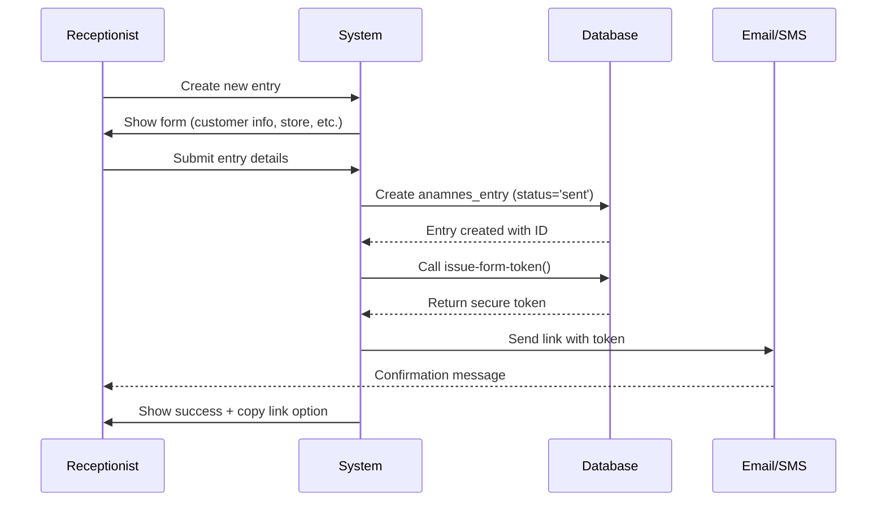

**Key Points:**
- Entry starts in 'sent' status
- Token is cryptographically secure UUID
- Link expires after 7 days by default
- Optionally specify booking date/time

### 2. Patient Receives Link

**Email/SMS contains:**
```
Hej [Name]!

Följ denna länk för att fylla i ditt anamnesformulär:
https://[domain]/patient/[token]

Länken är giltig i 7 dagar.

[Practice Name]
```

### 3. Patient Opens Form

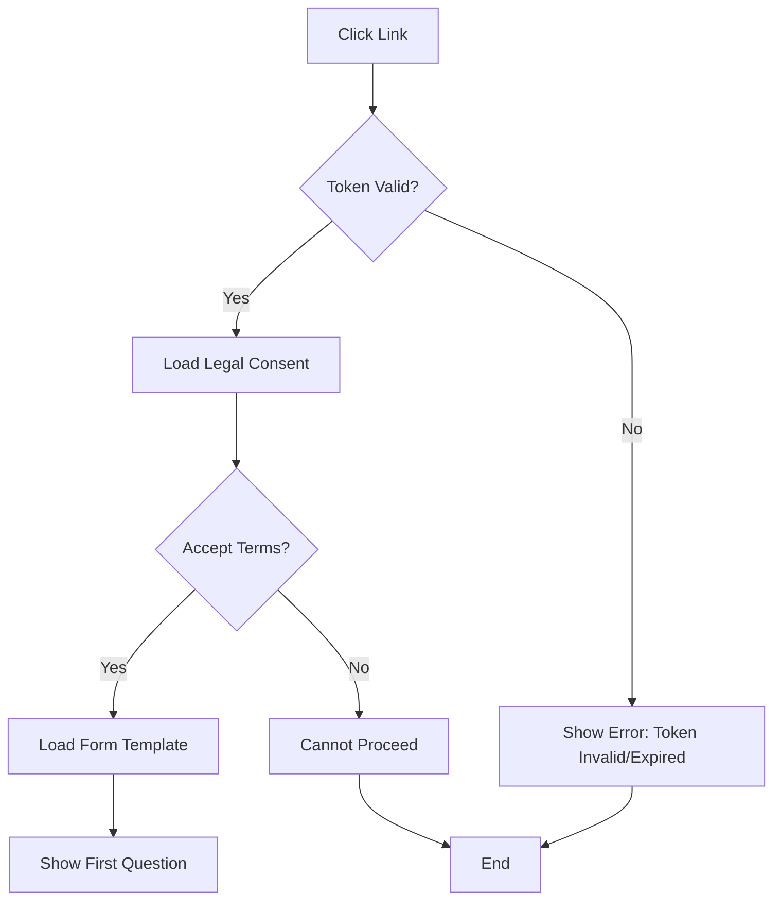

**Token Validation:**
- Check token exists in database
- Verify not expired (expires_at > now())
- Verify not already submitted (status != 'journaled')
- Verify entry belongs to correct organization

**Legal Consent Step:**
- Display Terms of Service
- Display Privacy Policy (GDPR)
- Require explicit consent checkbox
- Store consent_given = true, consent_timestamp, versions

### 4. Form Completion

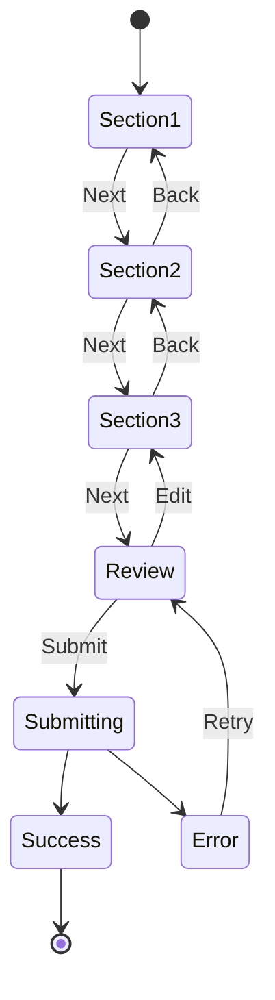

**Features:**
- **Auto-save**: Draft saved every 30 seconds
- **Progress tracking**: Visual progress bar
- **Validation**: Real-time field validation with Zod
- **Conditional logic**: Questions appear based on previous answers
- **Follow-up questions**: Nested questions for select/radio options

**Auto-save Implementation:**
```typescript
// Debounced auto-save every 30 seconds
useEffect(() => {
  const timer = setTimeout(() => {
    saveDraft(formValues);
  }, 30000);
  return () => clearTimeout(timer);
}, [formValues]);
```

### 5. Form Submission

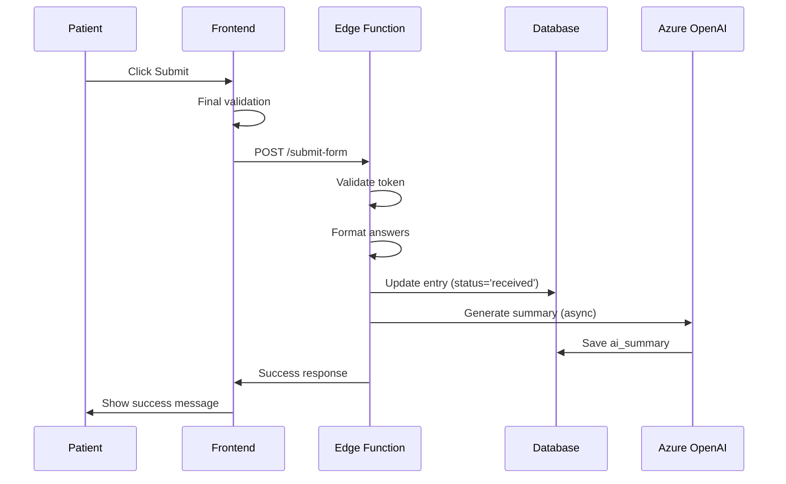

**Success Message:**
```
Tack för ditt svar!

Ditt formulär har skickats in och kommer att granskas av vår optiker.

Du kan nu stänga denna sida.
```

### 6. Post-Submission

- Patient cannot access form again (token invalidated)
- Entry status = 'received' (waiting for optician review)
- AI summary generated in background (15-30 seconds)
- Optician sees entry in their dashboard

---

## Kiosk Mode Flow

### 1. Kiosk Setup (by admin)

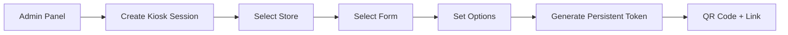

**Configuration Options:**
- **Store**: Which location is this kiosk at?
- **Form**: Which form template to use?
- **Supervisor code**: Require code for certain actions?
- **Expiration**: Set session expiration date

### 2. Kiosk Device Setup

**Display QR code or visit link:**
```
https://[domain]/kiosk/[persistent-token]
```

**Kiosk welcome screen shows:**
- Practice logo
- "Välkommen! Tryck för att börja"
- Touch-friendly large button
- Optional: Language selection

### 3. Customer Interaction

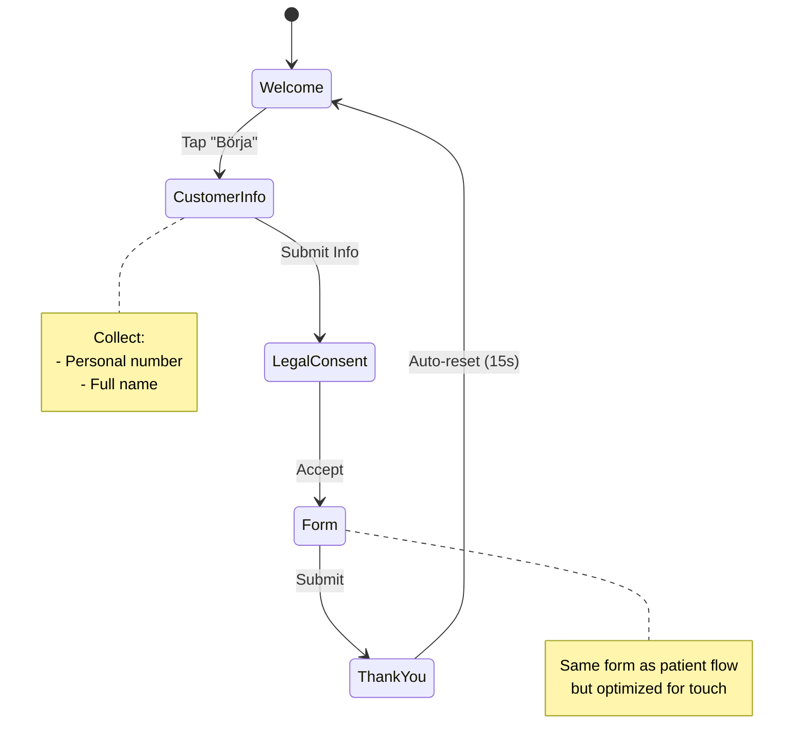

**Touch Optimization:**
- Larger buttons (min 44px touch targets)
- Single question per screen
- Reduced padding for iPad screens
- Auto-scroll to top on navigation

### 4. Kiosk-Specific Features

**Auto-reset Timer:**
```typescript
// Reset to welcome screen after 15 seconds of inactivity on thank you page
useEffect(() => {
  const timer = setTimeout(() => {
    navigate('/kiosk/welcome');
  }, 15000);
  return () => clearTimeout(timer);
}, []);
```

**Persistent Session:**
- Kiosk session never expires (until admin deactivates)
- Each submission creates new anamnes_entry
- All entries tagged with kiosk store_id
- is_kiosk_mode = true for tracking

**Entry Creation:**
```typescript
// Edge function: create-kiosk-entry
{
  personal_number: "YYYYMMDDXXXX",
  first_name: "John Doe",
  form_id: sessionFormId,
  store_id: sessionStoreId,
  organization_id: sessionOrgId,
  is_kiosk_mode: true,
  access_token: generateToken(),
  expires_at: Date.now() + 24 * 60 * 60 * 1000, // 24h
  status: 'sent'
}
```

---

## Optician Dashboard Flow

### 1. Dashboard Overview

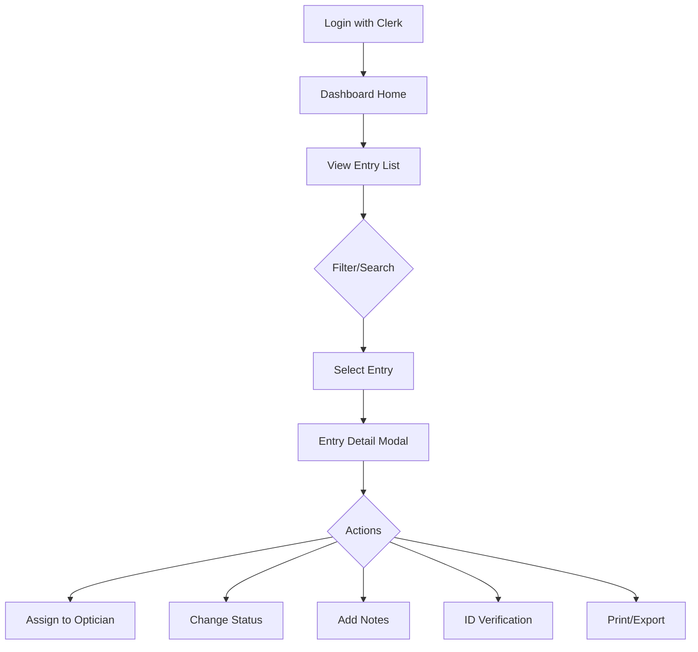

### 2. Entry List View

**Filters Available:**
- **Status**: sent, received, in_progress, reviewed, journaled
- **Time**: today, this week, this month, custom range
- **Store**: Filter by location
- **Optician**: Assigned optician
- **Examination type**: Synundersökning, Linsanpassning, Körkort
- **Unanswered**: Entries without all required answers

**Real-time Updates:**
```typescript
// Subscribed to changes
useEffect(() => {
  const subscription = supabase
    .channel('entries')
    .on('postgres_changes', 
      { event: '*', schema: 'public', table: 'anamnes_entries' },
      () => refetchEntries()
    )
    .subscribe();
}, []);
```

### 3. Entry Detail View

**Tabs:**
1. **Svar** - Formatted answers with AI summary
2. **Rådata** - JSON view of all data
3. **Historik** - Audit log of changes

**AI Summary Display:**
```
🤖 AI-Sammanfattning

Huvudsakliga besvär:
- Suddig syn på avstånd senaste 6 månaderna
- Huvudvärk efter skärmarbete

Tidigare synerfarenhet:
- Använder glasögon sedan 5 år
- Senaste undersökning: 2 år sedan

Rekommendationer:
- Uppdatera glasögonstyrka
- Kontrollera binokulär synfunktion
```

### 4. Status Transitions

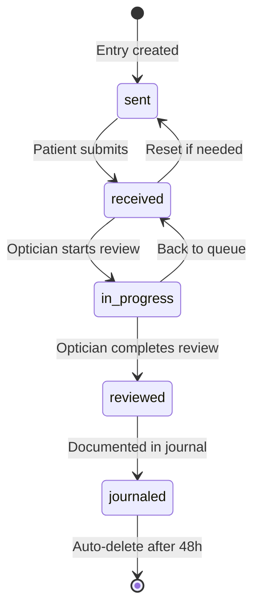

**Status Meanings:**
- **sent**: Waiting for patient to complete
- **received**: Submitted, waiting for review
- **in_progress**: Optician is reviewing
- **reviewed**: Review complete, ready to journal
- **journaled**: Documented, will be deleted in 48h

### 5. Assignment Flow

```typescript
// Quick assign from list
<QuickAssignDropdown
  entryId={entry.id}
  currentOpticianId={entry.optician_id}
  onAssign={(opticianId) => updateEntry({ optician_id: opticianId })}
/>

// Assign to self
<Button onClick={() => assignToMe(entry.id)}>
  Tilldela till mig
</Button>
```

**Assignment Rules:**
- Only users with 'optician' or 'admin' role can be assigned
- Assignment is optional (entries can be in a shared queue)
- Real-time notification to assigned optician (future feature)

---

## Driving License Examination Flow

### 1. Entry Point

Patient completes regular anamnesis form with `examination_type = 'Körkort'`.

### 2. Optician Actions

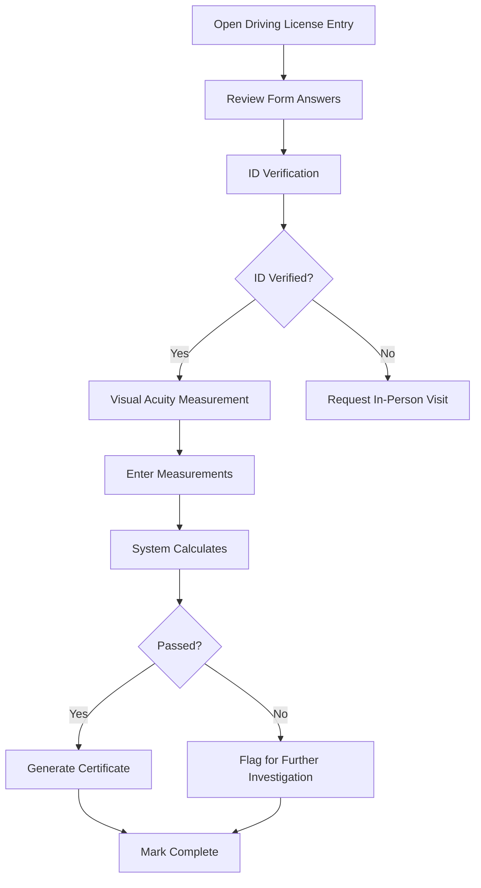

### 3. ID Verification Options

**ID Types:**
- Swedish ID card (Svenskt ID-kort)
- Passport (Pass)
- Driving license (Körkort)

**Verification Methods:**
1. **In-person**: Patient shows ID at practice
2. **Video call**: Verified via Zoom/Teams
3. **BankID**: Digital verification (future feature)

**Data Stored:**
```typescript
{
  id_verification_completed: true,
  id_type: 'swedish_id_card',
  personal_number: 'YYYYMMDDXXXX', // Verified
  verified_by: 'optician_user_id',
  verified_at: '2024-01-15T10:30:00Z'
}
```

### 4. Visual Acuity Measurement

**Data Entry:**
```typescript
interface VisualAcuityData {
  // Without correction
  visual_acuity_right_eye: 0.8,
  visual_acuity_left_eye: 0.9,
  visual_acuity_both_eyes: 1.0,
  
  // With correction (if applicable)
  uses_glasses: true,
  visual_acuity_with_correction_right: 1.0,
  visual_acuity_with_correction_left: 1.0,
  visual_acuity_with_correction_both: 1.2,
  
  // Prescription (if applicable)
  glasses_prescription_od_sph: -2.50,
  glasses_prescription_od_cyl: -0.75,
  glasses_prescription_od_axis: 180,
  // ... OS values
}
```

### 5. Automatic Decision Engine

```typescript
// Threshold for Swedish driving license (B category)
const THRESHOLD_BINOCULAR = 0.5;
const THRESHOLD_WORSE_EYE = 0.1;

const checkPassed = (measurements) => {
  const binocular = Math.max(
    measurements.visual_acuity_both_eyes,
    measurements.visual_acuity_with_correction_both
  );
  
  const worseEye = Math.min(
    Math.max(measurements.visual_acuity_right_eye, measurements.visual_acuity_with_correction_right),
    Math.max(measurements.visual_acuity_left_eye, measurements.visual_acuity_with_correction_left)
  );
  
  return binocular >= THRESHOLD_BINOCULAR && worseEye >= THRESHOLD_WORSE_EYE;
};
```

**Warning Flags:**
- Vision below threshold
- Large difference between eyes
- Progressive condition noted in form
- Multiple failed attempts

### 6. Certificate Generation

**If Passed:**
```
INTYG FÖR KÖRKORTSUNDERSÖKNING

Person: [Name] ([Personal Number])
Datum: [Date]
Utfärdat av: [Optician Name], [Practice]

Synschärpa:
- Båda ögon: [value]
- Höger öga: [value]
- Vänster öga: [value]

Korrektion: [Ja/Nej]

Bedömning: GODKÄND

Underskrift: [Digital signature]
```

---

## Admin Configuration Flow

### 1. Form Builder

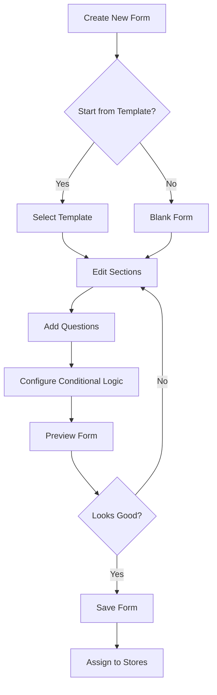

**Question Types:**
- Text (short answer)
- Textarea (long answer)
- Select (dropdown)
- Radio (single choice)
- Checkbox (multiple choice)
- Number (numeric input)
- Date (date picker)

**Conditional Logic:**
```typescript
{
  show_if_question: "has_glasses",
  show_if_value: "yes",
  questions: [
    { id: "glasses_since", type: "text", label: "Hur länge har du haft glasögon?" }
  ]
}
```

### 2. Store Management

**Create Store:**
```typescript
{
  name: "Stockholm Centrum",
  address: "Drottninggatan 123, 111 20 Stockholm",
  phone: "08-123 456 78",
  email: "stockholm@practice.se",
  external_id: "SC001", // Optional integration ID
  organization_id: "org_..."
}
```

**Auto-assignment:**
- When store is created, all organization forms are auto-assigned
- When form is created, all organization stores are auto-assigned
- Can be disabled per store-form pair

### 3. AI Prompt Configuration

**Global Default Prompts** (system org only):
```
Du är en klinisk assistent som sammanfattar patientanamnes. 
Skapa en tydlig, koncis sammanfattning som ska användas av optiker. 
Fokusera på kliniskt relevanta detaljer och organisera informationen logiskt.
```

**Organization-Specific Prompts:**
Organizations can override system defaults with custom prompts tailored to their workflow.

### 4. System Settings

**Data Retention:**
- Auto-deletion after journaling: 48 hours (default)
- Draft auto-save interval: 30 seconds
- Token expiration: 7 days

**GDPR Settings:**
- Enable/disable audit logging
- Anonymize patient data after N days
- Export all organization data

---

## Error Scenarios

### 1. Token Expired

**User sees:**
```
Länken har gått ut

Denna länk är inte längre giltig. 
Vänligen kontakta praktiken för en ny länk.

[Kontakta oss] button
```

**System behavior:**
- 404 or expired token page
- Log attempt in access logs
- No data exposed

### 2. Form Already Submitted

**User sees:**
```
Formuläret är redan inskickat

Du har redan besvarat detta formulär.
Om du behöver göra ändringar, kontakta praktiken.
```

### 3. Network Error During Submission

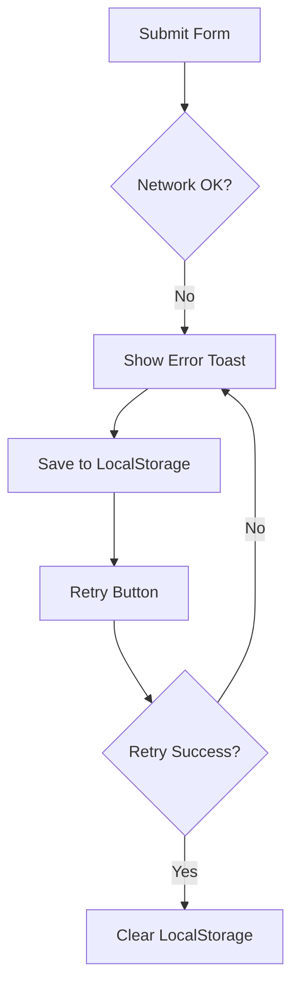

**Error Message:**
```
❌ Kunde inte skicka formuläret

Kontrollera din internetanslutning och försök igen.

[Försök igen] button
```

**Auto-retry Logic:**
```typescript
let retryCount = 0;
const MAX_RETRIES = 3;

const submitWithRetry = async () => {
  try {
    await submitForm();
  } catch (error) {
    if (retryCount < MAX_RETRIES) {
      retryCount++;
      setTimeout(submitWithRetry, 2000 * retryCount); // Exponential backoff
    } else {
      showError('Kunde inte skicka formuläret efter flera försök');
    }
  }
};
```

### 4. Validation Errors

**Field-level:**
- Show error message below field
- Prevent form submission
- Scroll to first error

**Form-level:**
- Required sections not completed
- Conditional validation failures

### 5. JWT Expiration (Opticians)

**Clerk token expires after 60 minutes**

```typescript
// Automatic refresh
useEffect(() => {
  const interval = setInterval(async () => {
    await clerk.session?.touch(); // Refresh session
  }, 50 * 60 * 1000); // Every 50 minutes
  
  return () => clearInterval(interval);
}, []);
```

**If refresh fails:**
- Redirect to sign-in page
- Preserve current URL for return after login

---

This document should be updated as new flows are added or existing flows change.
