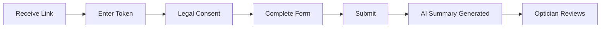
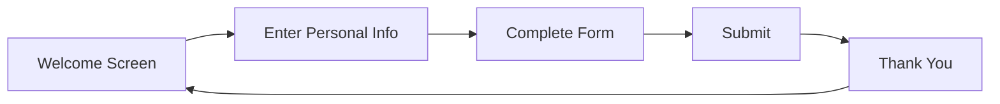
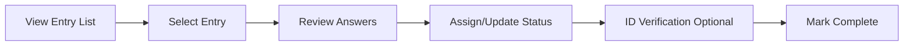

# Optician Anamnesis System

A comprehensive digital anamnesis and examination management system designed specifically for optician practices. This system streamlines patient data collection, form management, and clinical workflows while maintaining strict GDPR compliance and security standards.

## 🎯 Project Overview

This application provides:
- **Patient Self-Service Forms**: Token-based access for patients to complete anamnesis forms
- **Kiosk Mode**: Self-service stations in optician practices for walk-in patients
- **Optician Dashboard**: Review, assign, and manage patient entries with AI-powered summaries
- **Dynamic Form Builder**: Create and customize anamnesis forms with conditional logic
- **Driving License Examinations**: Specialized workflow for vision tests required for driver's licenses
- **GDPR Compliance**: Automated data retention, redaction, and audit logging

## 🏗️ Tech Stack

### Frontend
- **React 18** with **TypeScript** - Modern, type-safe component architecture
- **Vite** - Fast build tooling and HMR
- **React Router v6** - Client-side routing
- **TanStack Query v5** - Server state management and caching
- **React Hook Form** - Performant form state management
- **Zod** - Runtime schema validation

### UI/Design
- **Tailwind CSS** - Utility-first styling with custom design system ("Blue Pulse")
- **shadcn/ui** - Accessible, customizable component library
- **Radix UI** - Unstyled, accessible primitives
- **Lucide React** - Beautiful, consistent icons
- **Framer Motion** - Smooth animations and transitions

### Backend & Infrastructure
- **Supabase** - PostgreSQL database with real-time subscriptions
- **Edge Functions** (Deno) - Serverless backend logic
- **Row Level Security (RLS)** - Database-level access control
- **Azure OpenAI** - AI-powered anamnesis summaries

### Authentication & Authorization
- **Clerk** - User authentication and organization management
- **JWT-based tokens** - Secure, time-limited form access for patients

### State Management
- **Zustand** - Lightweight global state (user sync, kiosk sessions)
- **React Context** - Form orchestration and shared state

## 📁 Project Structure

```
├── src/
│   ├── components/          # React components organized by feature
│   │   ├── PatientForm/     # Patient-facing form components
│   │   ├── Optician/        # Optician dashboard components
│   │   ├── AdminPanel/      # Admin configuration components
│   │   ├── Kiosk/           # Kiosk mode components
│   │   ├── FormBuilder/     # Dynamic form creation tools
│   │   └── ui/              # shadcn/ui base components
│   ├── hooks/               # Custom React hooks
│   ├── contexts/            # React Context providers
│   ├── pages/               # Route-level page components
│   ├── utils/               # Utility functions
│   ├── types/               # TypeScript type definitions
│   ├── templates/           # Form templates (CISS, etc.)
│   ├── integrations/        # External service integrations
│   │   └── supabase/        # Supabase client and types
│   └── styles/              # Global styles and animations
├── supabase/
│   ├── functions/           # Edge Functions (Deno)
│   │   ├── submit-form/     # Form submission handler
│   │   ├── generate-summary/ # AI summary generation
│   │   ├── issue-form-token/ # Token creation
│   │   └── ...              # Other edge functions
│   ├── migrations/          # Database schema migrations
│   └── config.toml          # Supabase configuration
└── docs/                    # Additional documentation
```

## 🔄 Key User Flows

### Patient Flow


### Kiosk Flow


### Optician Flow


## 🗄️ Database Schema

### Core Tables

- **organizations** - Multi-tenant organization records
- **users** - Staff members with roles (admin, optician, receptionist)
- **stores** - Physical locations within organizations
- **anamnes_forms** - Form templates with JSON schema
- **anamnes_entries** - Completed form submissions
- **store_forms** - Many-to-many relationship between stores and forms
- **driving_license_examinations** - Specialized driving license data
- **kiosk_sessions** - Active kiosk mode sessions

### Security & Compliance

- **audit_data_access** - GDPR-compliant access logging
- **audit_auth_logs** - Authentication event tracking
- **auto_deletion_logs** - Automated data retention logs
- **feedback** - User feedback and bug reports

See [docs/DATABASE.md](docs/DATABASE.md) for detailed schema documentation.

## 🔒 Security Architecture

### Row Level Security (RLS)
All tables use PostgreSQL RLS policies to enforce:
- Organization-level data isolation
- Role-based access control
- Token-based anonymous access for patient forms

### Token-Based Access
- Short-lived JWT tokens for form access
- Tokens scoped to specific entries
- Automatic expiration and cleanup

### GDPR Compliance
- Automated data redaction after configurable periods
- Audit logging for all data access
- Right to erasure workflows
- Consent tracking with legal document versioning

See [docs/SECURITY.md](docs/SECURITY.md) for security details.

## 🎨 Design System: "Blue Pulse"

### Color Palette
```css
--primary: hsl(210 100% 40%)    /* Medical trust blue */
--accent-1: hsl(173 64% 45%)    /* Teal pulse */
--accent-2: hsl(12 90% 55%)     /* Coral spark */
--surface-light: hsl(210 20% 98%)
--surface-dark: hsl(220 15% 16%)
```

### Typography
- **Body**: Inter (neutral readability)
- **Headings**: Poppins SemiBold (friendly circular forms)

### Design Principles
- 8px baseline grid for consistent spacing
- WCAG AA contrast ratios minimum
- Smooth microinteractions (transitions, hover states)
- Mobile-first responsive design
- Touch-friendly targets (min 44px) for kiosk mode

## 🚀 Getting Started

### Prerequisites
- Node.js 18+ (recommended: use nvm)
- A Supabase account and project
- A Clerk account for authentication

### Installation

```bash
# Clone the repository
git clone <repository-url>
cd <project-name>

# Install dependencies
npm install

# Set up environment variables (see .env.example)
cp .env.example .env

# Start development server
npm run dev
```

### Environment Variables

```bash
# Supabase
VITE_SUPABASE_URL=https://your-project.supabase.co
VITE_SUPABASE_ANON_KEY=your-anon-key

# Clerk
VITE_CLERK_PUBLISHABLE_KEY=your-clerk-key

# Azure OpenAI (for edge functions)
AZURE_OPENAI_API_KEY=your-azure-key
AZURE_OPENAI_BASE_ENDPOINT=https://your-endpoint.openai.azure.com
AZURE_OPENAI_DEPLOYMENT_NAME=your-deployment
```

### Development

```bash
# Run dev server
npm run dev

# Build for production
npm run build

# Preview production build
npm run preview

# Lint code
npm run lint
```

## 🧪 Testing Edge Functions

Edge functions are deployed automatically. To test locally:

```bash
# Install Supabase CLI
npm install -g supabase

# Start local Supabase
supabase start

# Serve functions locally
supabase functions serve

# Invoke a function
supabase functions invoke submit-form --data '{"token":"...", "answers":{...}}'
```

## 📦 Deployment

The application is deployed via:
- **Frontend**: Lovable deployment platform (or custom hosting)
- **Backend**: Supabase Edge Functions (auto-deployed)
- **Database**: Supabase PostgreSQL

### Edge Function Deployment

Edge functions are automatically deployed when code is pushed. They're configured in `supabase/config.toml`:

```toml
[functions.submit-form]
verify_jwt = false  # Public access with token validation
```

## 🏛️ Architecture

The system follows a modern, type-safe architecture with clear separation of concerns:

- **Component Layer**: Presentational components with minimal logic
- **Hook Layer**: Reusable business logic and data fetching
- **Context Layer**: Shared state for complex features (forms, auth)
- **Service Layer**: Edge functions for backend operations
- **Data Layer**: PostgreSQL with RLS for security

See [ARCHITECTURE.md](ARCHITECTURE.md) for detailed architectural decisions.

## 📖 Additional Documentation

- [ARCHITECTURE.md](ARCHITECTURE.md) - Deep dive into system architecture
- [FLOWS.md](FLOWS.md) - Detailed user flows and scenarios
- [CONTRIBUTING.md](CONTRIBUTING.md) - Contribution guidelines
- [docs/SECURITY.md](docs/SECURITY.md) - Security implementation details
- [docs/DATABASE.md](docs/DATABASE.md) - Database schema and relationships

## 🤝 Contributing

We welcome contributions! Please read [CONTRIBUTING.md](CONTRIBUTING.md) for:
- Code style guidelines
- Pull request process
- Testing requirements
- Commit message conventions

## 📝 Code Conventions

### File Headers
Every file should start with a comment explaining its purpose:

```typescript
/**
 * This component handles patient form submission with validation,
 * auto-save, and progress tracking. It orchestrates the form context
 * and renders the appropriate layout based on device capabilities.
 */
```

### Component Organization
- One component per file
- Co-locate related components in feature folders
- Extract complex logic into custom hooks
- Use TypeScript strict mode

### Naming Conventions
- Components: PascalCase (`FormOrchestrator.tsx`)
- Hooks: camelCase with `use` prefix (`useFormSubmission.ts`)
- Utils: camelCase (`anamnesisTextUtils.ts`)
- Types: PascalCase (`FormTemplate`, `AnamnesisEntry`)

## 🐛 Known Issues & Limitations

- Safari on iOS may have issues with token refresh (workaround implemented)
- Large forms (>50 questions) may experience performance degradation
- Real-time updates limited to same-organization users

## 📄 License

[Your license here]

## 🆘 Support

For issues and questions:
- Create an issue in GitHub
- Contact the development team
- Check documentation in `/docs` folder

---

**Built with ❤️ for modern optician practices**
