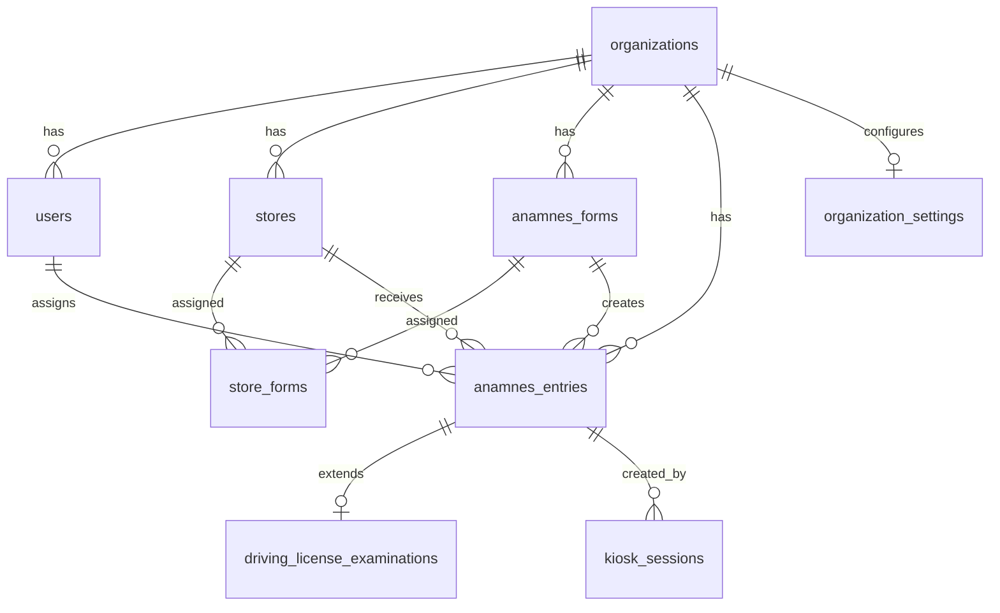

# Database Schema Documentation

Comprehensive documentation of the PostgreSQL database schema, relationships, and design decisions.

## Table of Contents
- [Schema Overview](#schema-overview)
- [Core Tables](#core-tables)
- [Relationships](#relationships)
- [Indexes](#indexes)
- [Row Level Security](#row-level-security)
- [Database Functions](#database-functions)
- [Triggers](#triggers)
- [Migrations](#migrations)

## Schema Overview

### Entity Relationship Diagram



## Core Tables

### organizations

**Purpose**: Multi-tenant organization records (companies, practices)

```sql
CREATE TABLE organizations (
  id TEXT PRIMARY KEY,
  name TEXT NOT NULL,
  is_system_org BOOLEAN DEFAULT false
);
```

**Columns:**
- `id` (TEXT, PK): Clerk organization ID
- `name` (TEXT): Organization display name
- `is_system_org` (BOOLEAN): Special flag for system administrators

**Key Points:**
- IDs come from Clerk authentication
- One row per practice/company
- System org has elevated permissions for managing global settings

---

### users

**Purpose**: Staff members with role-based access

```sql
CREATE TABLE users (
  id UUID PRIMARY KEY DEFAULT gen_random_uuid(),
  clerk_user_id TEXT NOT NULL UNIQUE,
  organization_id TEXT NOT NULL REFERENCES organizations(id),
  email TEXT,
  first_name TEXT,
  last_name TEXT,
  display_name TEXT,
  role TEXT NOT NULL DEFAULT 'optician',
  onboarding_completed BOOLEAN DEFAULT false,
  onboarding_step INTEGER DEFAULT 0
);
```

**Columns:**
- `id` (UUID, PK): Internal user ID
- `clerk_user_id` (TEXT, unique): Links to Clerk authentication
- `organization_id` (TEXT, FK): User's organization
- `role` (TEXT): 'admin', 'optician', 'receptionist'
- `onboarding_completed` (BOOLEAN): Has user completed setup?

**Roles:**
- **admin**: Full access, can manage forms, stores, users
- **optician**: Can review entries, assign to self
- **receptionist**: Can create entries, view list (limited access)

---

### stores

**Purpose**: Physical locations within an organization

```sql
CREATE TABLE stores (
  id UUID PRIMARY KEY DEFAULT gen_random_uuid(),
  organization_id TEXT NOT NULL REFERENCES organizations(id),
  name TEXT NOT NULL,
  address TEXT,
  phone TEXT,
  email TEXT,
  external_id TEXT,
  metadata JSONB,
  created_at TIMESTAMPTZ NOT NULL DEFAULT now(),
  updated_at TIMESTAMPTZ NOT NULL DEFAULT now()
);
```

**Columns:**
- `id` (UUID, PK): Store identifier
- `name` (TEXT): "Stockholm Centrum", "Göteborg"
- `external_id` (TEXT): For integration with external systems (booking, ERP)
- `metadata` (JSONB): Flexible storage for additional data

**Indexes:**
- `idx_stores_org`: `(organization_id)` - Fast lookup by org
- `idx_stores_external_id`: `(external_id)` - Integration lookups

---

### anamnes_forms

**Purpose**: Form templates with JSON schema

```sql
CREATE TABLE anamnes_forms (
  id UUID PRIMARY KEY DEFAULT gen_random_uuid(),
  organization_id TEXT REFERENCES organizations(id),
  title TEXT NOT NULL,
  schema JSONB NOT NULL,
  examination_type TEXT DEFAULT 'Synundersökning',
  is_active BOOLEAN DEFAULT true,
  is_template BOOLEAN DEFAULT false,
  is_global_template BOOLEAN DEFAULT false,
  version INTEGER DEFAULT 1,
  created_at TIMESTAMPTZ DEFAULT now()
);
```

**Schema Structure:**
```typescript
{
  title: "Synundersökning",
  sections: [
    {
      section_title: "Nuvarande besvär",
      questions: [
        {
          id: "current_complaints",
          type: "textarea",
          label: "Beskriv dina nuvarande besvär",
          required: true
        },
        {
          id: "has_glasses",
          type: "radio",
          label: "Använder du glasögon?",
          options: [
            { label: "Ja", value: "yes" },
            { label: "Nej", value: "no" }
          ]
        }
      ]
    }
  ]
}
```

**Template Types:**
- **Regular form** (`is_template=false`): Active form in organization
- **Organization template** (`is_template=true`): Reusable within org
- **Global template** (`is_global_template=true`): Available to all orgs (system only)

---

### anamnes_entries

**Purpose**: Completed form submissions (patient anamnesis records)

```sql
CREATE TABLE anamnes_entries (
  id UUID PRIMARY KEY DEFAULT gen_random_uuid(),
  organization_id TEXT NOT NULL,
  form_id UUID NOT NULL REFERENCES anamnes_forms(id),
  store_id UUID REFERENCES stores(id),
  
  -- Patient data
  first_name TEXT,
  personal_number TEXT,
  booking_id TEXT,
  booking_date TIMESTAMPTZ,
  
  -- Token-based access
  access_token TEXT UNIQUE,
  expires_at TIMESTAMPTZ,
  
  -- Form data
  answers JSONB,
  formatted_raw_data TEXT,
  ai_summary TEXT,
  scoring_result JSONB,
  examination_type TEXT,
  
  -- Workflow
  status TEXT DEFAULT 'sent',
  optician_id TEXT REFERENCES users(clerk_user_id),
  internal_notes TEXT,
  
  -- GDPR
  consent_given BOOLEAN DEFAULT false,
  consent_timestamp TIMESTAMPTZ,
  privacy_policy_version TEXT,
  terms_version TEXT,
  
  -- Redaction & Deletion
  is_redacted BOOLEAN DEFAULT false,
  redacted_at TIMESTAMPTZ,
  auto_deletion_timestamp TIMESTAMPTZ,
  
  -- ID Verification
  id_verification_completed BOOLEAN DEFAULT false,
  id_type TEXT,
  verified_by TEXT,
  verified_at TIMESTAMPTZ,
  
  -- Kiosk mode
  is_kiosk_mode BOOLEAN DEFAULT false,
  
  -- Timestamps
  created_at TIMESTAMPTZ DEFAULT now(),
  updated_at TIMESTAMPTZ DEFAULT now(),
  sent_at TIMESTAMPTZ
);
```

**Status Flow:**
```
sent → received → in_progress → reviewed → journaled
```

**Key Columns:**
- `answers` (JSONB): Raw form responses `{"question_id": "answer"}`
- `formatted_raw_data` (TEXT): Human-readable formatted answers
- `ai_summary` (TEXT): Azure OpenAI-generated summary
- `scoring_result` (JSONB): For CISS and other scored forms

**Indexes:**
- `idx_entries_org_status`: `(organization_id, status)` - Main query
- `idx_entries_token`: `(access_token)` - Token lookups
- `idx_entries_optician`: `(optician_id)` - "My entries" view
- `idx_entries_created_at`: `(created_at DESC)` - Recent entries

---

### store_forms

**Purpose**: Many-to-many relationship between stores and forms

```sql
CREATE TABLE store_forms (
  id UUID PRIMARY KEY DEFAULT gen_random_uuid(),
  store_id UUID NOT NULL REFERENCES stores(id),
  form_id UUID NOT NULL REFERENCES anamnes_forms(id),
  organization_id TEXT NOT NULL,
  is_active BOOLEAN NOT NULL DEFAULT true,
  created_at TIMESTAMPTZ NOT NULL DEFAULT now(),
  updated_at TIMESTAMPTZ NOT NULL DEFAULT now(),
  UNIQUE(store_id, form_id)
);
```

**Purpose:**
- Controls which forms are available at which stores
- Enables store-specific form configuration
- Auto-assigned on store/form creation (via triggers)

---

### driving_license_examinations

**Purpose**: Extended data for driving license vision tests

```sql
CREATE TABLE driving_license_examinations (
  id UUID PRIMARY KEY DEFAULT gen_random_uuid(),
  entry_id UUID NOT NULL REFERENCES anamnes_entries(id) ON DELETE CASCADE,
  organization_id TEXT NOT NULL,
  
  -- ID Verification
  personal_number TEXT,
  id_verification_completed BOOLEAN DEFAULT false,
  id_type TEXT,
  verified_by TEXT,
  verified_at TIMESTAMPTZ,
  
  -- Visual Acuity
  visual_acuity_right_eye NUMERIC,
  visual_acuity_left_eye NUMERIC,
  visual_acuity_both_eyes NUMERIC,
  
  -- With Correction
  uses_glasses BOOLEAN DEFAULT false,
  uses_contact_lenses BOOLEAN DEFAULT false,
  visual_acuity_with_correction_right NUMERIC,
  visual_acuity_with_correction_left NUMERIC,
  visual_acuity_with_correction_both NUMERIC,
  
  -- Prescription
  glasses_prescription_od_sph NUMERIC,
  glasses_prescription_od_cyl NUMERIC,
  glasses_prescription_od_axis SMALLINT,
  glasses_prescription_os_sph NUMERIC,
  glasses_prescription_os_cyl NUMERIC,
  glasses_prescription_os_axis SMALLINT,
  
  -- Decision
  passed_examination BOOLEAN,
  vision_below_limit BOOLEAN DEFAULT false,
  requires_optician_visit BOOLEAN DEFAULT false,
  requires_further_investigation BOOLEAN DEFAULT false,
  warning_flags JSONB DEFAULT '[]',
  
  -- Optician Decision
  optician_decision TEXT,
  optician_notes TEXT,
  decided_by TEXT,
  optician_decision_date TIMESTAMPTZ,
  
  -- Audit
  created_by TEXT,
  created_at TIMESTAMPTZ NOT NULL DEFAULT now(),
  updated_at TIMESTAMPTZ NOT NULL DEFAULT now()
);
```

**Decision Logic:**
```typescript
// Swedish driving license requirements (B category)
const THRESHOLD_BINOCULAR = 0.5;  // 50% vision both eyes
const THRESHOLD_WORSE_EYE = 0.1;  // 10% vision worse eye

const passed = (
  binocularVision >= THRESHOLD_BINOCULAR &&
  worseEyeVision >= THRESHOLD_WORSE_EYE
);
```

---

### kiosk_sessions

**Purpose**: Persistent kiosk mode sessions

```sql
CREATE TABLE kiosk_sessions (
  id UUID PRIMARY KEY DEFAULT gen_random_uuid(),
  organization_id TEXT NOT NULL,
  store_id UUID REFERENCES stores(id),
  form_id UUID NOT NULL REFERENCES anamnes_forms(id),
  
  persistent_token TEXT NOT NULL UNIQUE,
  is_active BOOLEAN DEFAULT true,
  expires_at TIMESTAMPTZ,
  
  total_submissions INTEGER DEFAULT 0,
  last_used_at TIMESTAMPTZ,
  
  require_supervisor_code BOOLEAN DEFAULT false,
  
  created_by TEXT,
  created_at TIMESTAMPTZ DEFAULT now()
);
```

**Lifecycle:**
1. Admin creates kiosk session → `persistent_token` generated
2. Kiosk device uses token to access form
3. Each submission increments `total_submissions`
4. Session never expires unless admin deactivates

---

### Audit & Compliance Tables

#### audit_data_access

**Purpose**: GDPR-compliant access logging

```sql
CREATE TABLE audit_data_access (
  id UUID PRIMARY KEY DEFAULT gen_random_uuid(),
  user_id TEXT NOT NULL,
  organization_id TEXT NOT NULL,
  table_name TEXT NOT NULL,
  record_id TEXT,
  action_type TEXT NOT NULL,
  purpose TEXT,
  route TEXT,
  ip_address_anonymized TEXT,
  user_agent TEXT,
  created_at TIMESTAMPTZ NOT NULL DEFAULT now()
);
```

**Logged Actions:**
- `read`: User viewed data
- `create`: User created record
- `update`: User modified record
- `delete`: User deleted record

#### audit_auth_logs

**Purpose**: Authentication event tracking

```sql
CREATE TABLE audit_auth_logs (
  id UUID PRIMARY KEY DEFAULT gen_random_uuid(),
  user_id TEXT NOT NULL,
  organization_id TEXT NOT NULL,
  event_type TEXT NOT NULL,
  email TEXT,
  clerk_user_id TEXT,
  session_id TEXT,
  ip_address_anonymized TEXT,
  user_agent TEXT,
  metadata JSONB DEFAULT '{}',
  created_at TIMESTAMPTZ NOT NULL DEFAULT now()
);
```

## Relationships

### One-to-Many

- `organizations` → `users`
- `organizations` → `stores`
- `organizations` → `anamnes_forms`
- `organizations` → `anamnes_entries`
- `anamnes_forms` → `anamnes_entries`
- `stores` → `anamnes_entries`
- `users` → `anamnes_entries` (assigned optician)

### Many-to-Many

- `stores` ↔ `anamnes_forms` (via `store_forms`)

### One-to-One

- `anamnes_entries` → `driving_license_examinations` (optional extension)

## Indexes

### Critical Performance Indexes

```sql
-- Most frequent query: List entries for organization
CREATE INDEX idx_entries_org_status 
ON anamnes_entries(organization_id, status);

-- Token validation
CREATE INDEX idx_entries_token 
ON anamnes_entries(access_token) 
WHERE access_token IS NOT NULL;

-- Optician dashboard: "My entries"
CREATE INDEX idx_entries_optician 
ON anamnes_entries(optician_id) 
WHERE optician_id IS NOT NULL;

-- Recent entries (ordered by date)
CREATE INDEX idx_entries_created_at 
ON anamnes_entries(created_at DESC);

-- Store-specific entries
CREATE INDEX idx_entries_store 
ON anamnes_entries(store_id) 
WHERE store_id IS NOT NULL;

-- Auto-deletion job
CREATE INDEX idx_entries_auto_deletion 
ON anamnes_entries(auto_deletion_timestamp) 
WHERE auto_deletion_timestamp IS NOT NULL;
```

## Row Level Security

See [docs/SECURITY.md](SECURITY.md) for detailed RLS documentation.

**Key Policies:**

1. **Organization Isolation**: All tables enforce `organization_id` matching
2. **Token-Based Access**: Entries accessible via valid token
3. **Role-Based Access**: Admins have elevated permissions

## Database Functions

### set_access_token(token TEXT)

**Purpose**: Set session variable for RLS token validation

```sql
CREATE FUNCTION set_access_token(token TEXT)
RETURNS void AS $$
BEGIN
  PERFORM set_config('app.access_token', token, false);
END;
$$ LANGUAGE plpgsql SECURITY DEFINER;
```

**Usage**: Called by edge functions before accessing entries via token

---

### auto_assign_form_to_stores()

**Purpose**: Trigger function to auto-assign new forms to all org stores

```sql
CREATE FUNCTION auto_assign_form_to_stores()
RETURNS TRIGGER AS $$
BEGIN
  INSERT INTO store_forms (store_id, form_id, organization_id, is_active)
  SELECT s.id, NEW.id, NEW.organization_id, true
  FROM stores s
  WHERE s.organization_id = NEW.organization_id
  ON CONFLICT (store_id, form_id) DO NOTHING;
  
  RETURN NEW;
END;
$$ LANGUAGE plpgsql SECURITY DEFINER;
```

---

### auto_assign_store_to_forms()

**Purpose**: Trigger function to auto-assign new stores to all org forms

```sql
CREATE FUNCTION auto_assign_store_to_forms()
RETURNS TRIGGER AS $$
BEGIN
  INSERT INTO store_forms (store_id, form_id, organization_id, is_active)
  SELECT NEW.id, f.id, NEW.organization_id, true
  FROM anamnes_forms f
  WHERE f.organization_id = NEW.organization_id
  ON CONFLICT (store_id, form_id) DO NOTHING;
  
  RETURN NEW;
END;
$$ LANGUAGE plpgsql SECURITY DEFINER;
```

## Triggers

### update_timestamp

**Purpose**: Automatically update `updated_at` on row changes

```sql
CREATE TRIGGER update_anamnes_entries_timestamp
BEFORE UPDATE ON anamnes_entries
FOR EACH ROW EXECUTE FUNCTION update_timestamp();
```

Applied to: `anamnes_entries`, `stores`, `users`, `kiosk_sessions`

---

### set_auto_deletion_timestamp

**Purpose**: Set auto-deletion time when entry is journaled

```sql
CREATE TRIGGER set_auto_deletion_on_journal
BEFORE UPDATE ON anamnes_entries
FOR EACH ROW EXECUTE FUNCTION set_auto_deletion_timestamp();
```

**Logic:**
```sql
IF NEW.status = 'journaled' AND OLD.status != 'journaled' THEN
  NEW.auto_deletion_timestamp := NOW() + INTERVAL '48 hours';
END IF;
```

---

### audit_anamnes_entries_changes

**Purpose**: Log all changes to entries for GDPR compliance

```sql
CREATE TRIGGER audit_entries
AFTER INSERT OR UPDATE OR DELETE ON anamnes_entries
FOR EACH ROW EXECUTE FUNCTION audit_anamnes_entries_changes();
```

## Migrations

Migrations are stored in `supabase/migrations/` and applied in order.

**Naming Convention:**
```
YYYYMMDDHHMMSS_description.sql
```

**Example:**
```
20240115103000_create_anamnes_entries.sql
20240115104500_add_rls_policies.sql
20240116090000_add_driving_license_table.sql
```

**Best Practices:**
1. Always use transactions
2. Make migrations reversible (include DROP statements in comments)
3. Test migrations on staging first
4. Never modify existing migrations (create new ones)

---

**Last Updated:** 2024-01-15  
**Next Review:** 2024-07-15
