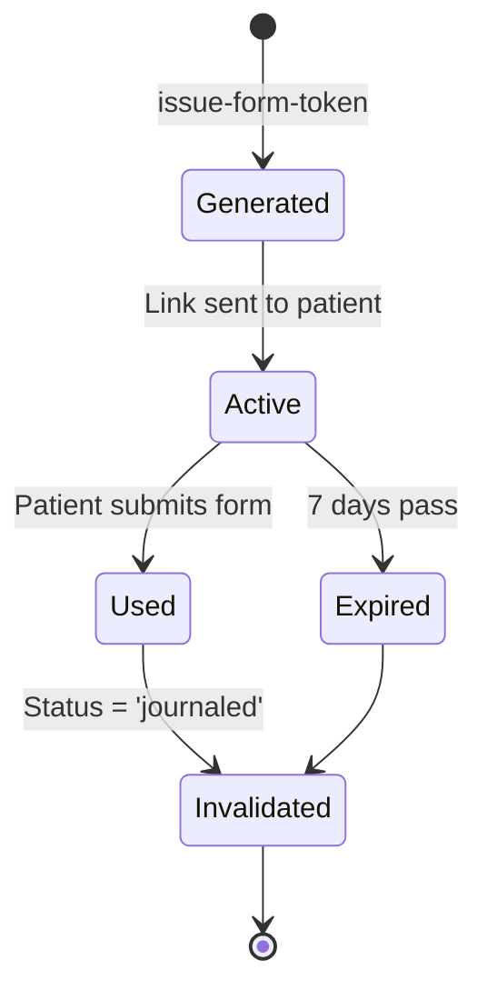

# Security Documentation

This document details the security architecture, measures, and best practices implemented in the Optician Anamnesis System.

## Table of Contents
- [Security Architecture](#security-architecture)
- [Authentication & Authorization](#authentication--authorization)
- [Row Level Security (RLS)](#row-level-security-rls)
- [Token Security](#token-security)
- [Data Protection](#data-protection)
- [GDPR Compliance](#gdpr-compliance)
- [Audit Logging](#audit-logging)
- [Security Best Practices](#security-best-practices)

## Security Architecture

### Multi-Layered Defense

```
┌──────────────────────────────────────────────┐
│ Layer 1: Network Security                   │
│ - HTTPS/TLS encryption                      │
│ - CORS policies                             │
│ - Rate limiting                             │
└──────────────────────────────────────────────┘
                    ↓
┌──────────────────────────────────────────────┐
│ Layer 2: Authentication                      │
│ - Clerk (staff)                             │
│ - JWT tokens (patients)                     │
│ - Token expiration                          │
└──────────────────────────────────────────────┘
                    ↓
┌──────────────────────────────────────────────┐
│ Layer 3: Authorization                       │
│ - Row Level Security (RLS)                  │
│ - Organization isolation                    │
│ - Role-based access control                │
└──────────────────────────────────────────────┘
                    ↓
┌──────────────────────────────────────────────┐
│ Layer 4: Data Validation                    │
│ - Zod schemas                               │
│ - Database constraints                      │
│ - Input sanitization                        │
└──────────────────────────────────────────────┘
                    ↓
┌──────────────────────────────────────────────┐
│ Layer 5: Audit & Monitoring                 │
│ - Access logging                            │
│ - Change tracking                           │
│ - Anomaly detection                         │
└──────────────────────────────────────────────┘
```

## Authentication & Authorization

### Staff Authentication (Clerk)

**Clerk provides:**
- Organization-based multi-tenancy
- Role management (org:admin, org:member)
- Session management
- JWT token issuance

**JWT Claims:**
```json
{
  "sub": "user_abc123",           // Clerk user ID
  "org_id": "org_xyz789",         // Organization ID
  "org_role": "org:admin",        // Role in organization
  "email": "optician@example.com",
  "iat": 1704067200,
  "exp": 1704070800              // 1 hour expiration
}
```

**Token Refresh Strategy:**
```typescript
// Automatic refresh before expiration
useEffect(() => {
  const interval = setInterval(async () => {
    await clerk.session?.touch(); // Refresh session
  }, 50 * 60 * 1000); // Every 50 minutes (token expires at 60)
  
  return () => clearInterval(interval);
}, [clerk]);
```

### Patient Access (Token-Based)

**Token Generation:**
```typescript
// In issue-form-token edge function
const token = crypto.randomUUID(); // 36-char UUID v4
const expiresAt = new Date(Date.now() + 7 * 24 * 60 * 60 * 1000); // 7 days

await supabase
  .from('anamnes_entries')
  .update({ 
    access_token: token,
    expires_at: expiresAt,
    status: 'sent'
  })
  .eq('id', entryId);
```

**Token Validation:**
```typescript
// In submit-form edge function
const { data: entry, error } = await supabase
  .from('anamnes_entries')
  .select('*')
  .eq('access_token', token)
  .gt('expires_at', new Date().toISOString())
  .single();

if (error || !entry) {
  throw new Error('Invalid or expired token');
}

// Set token in database session for RLS
await supabase.rpc('set_access_token', { token });
```

## Row Level Security (RLS)

### Organization Isolation

**All tables enforce organization isolation:**

```sql
-- Example: anamnes_entries
CREATE POLICY "Organization members can view entries"
ON public.anamnes_entries
FOR SELECT
USING ((auth.jwt() ->> 'org_id') = organization_id);
```

**Key Principles:**
1. **Default Deny**: No access unless explicitly granted
2. **Organization Scoped**: All data isolated by organization_id
3. **Role Based**: Different policies for admin vs. optician
4. **Audit Safe**: All access logged via triggers

### Token-Based Access for Forms

```sql
-- Patients can access their entry via token
CREATE POLICY "Public access with token for select"
ON public.anamnes_entries
FOR SELECT
USING (
  access_token IS NOT NULL 
  AND access_token = current_setting('app.access_token', true)
);

-- Patients can update their entry via token
CREATE POLICY "Public access with token for update"
ON public.anamnes_entries
FOR UPDATE
USING (
  access_token IS NOT NULL 
  AND access_token = current_setting('app.access_token', true)
);
```

**How it works:**
1. Patient provides token in request
2. Edge function validates token
3. Edge function calls `set_access_token(token)` database function
4. Database function sets PostgreSQL session variable
5. RLS policy checks session variable
6. Access granted if token matches

### Role-Based Policies

```sql
-- Admins can assign opticians
CREATE POLICY "Admins can update optician assignments"
ON public.anamnes_entries
FOR UPDATE
USING (
  (auth.jwt() ->> 'org_id') = organization_id
  AND (auth.jwt() ->> 'org_role') = 'org:admin'
);

-- Opticians can view entries in their org
CREATE POLICY "Organization members can view entries"
ON public.anamnes_entries
FOR SELECT
USING ((auth.jwt() ->> 'org_id') = organization_id);
```

## Token Security

### Token Properties

- **Type**: UUID v4 (128-bit random)
- **Length**: 36 characters
- **Entropy**: 122 bits
- **Collision probability**: ~1 in 2^61 (negligible)

### Token Lifecycle



### Token Storage

**Database:**
- Stored in `anamnes_entries.access_token` column
- Indexed for fast lookup
- Not hashed (needs to be validated exactly)
- Paired with `expires_at` timestamp

**Security Measures:**
1. **Short-lived**: 7 days default (configurable)
2. **Single-use**: Cannot resubmit after journaling
3. **Scoped**: Tied to specific entry and organization
4. **Audited**: All access logged

### Token Validation Checklist

```typescript
// Complete validation in edge functions
const validateToken = async (token: string) => {
  // 1. Token format check
  if (!isValidUUID(token)) {
    throw new Error('Invalid token format');
  }
  
  // 2. Database lookup
  const entry = await getEntryByToken(token);
  if (!entry) {
    throw new Error('Token not found');
  }
  
  // 3. Expiration check
  if (new Date(entry.expires_at) < new Date()) {
    throw new Error('Token expired');
  }
  
  // 4. Status check
  if (entry.status === 'journaled') {
    throw new Error('Entry already completed');
  }
  
  return entry;
};
```

## Data Protection

### Data in Transit

- **HTTPS/TLS 1.3**: All connections encrypted
- **HSTS**: Strict Transport Security enabled
- **Certificate Pinning**: For mobile apps (future)

### Data at Rest

- **Database Encryption**: PostgreSQL with encryption at rest (Supabase)
- **Backup Encryption**: Automatic encrypted backups
- **Secret Storage**: Environment variables for API keys

### Sensitive Data Handling

**Personal Identifiable Information (PII):**
- `personal_number`: Swedish personal number (YYYYMMDD-XXXX)
- `first_name`: Patient name
- `answers`: Form responses (may contain health data)

**Protection Measures:**
1. **RLS Enforcement**: All access controlled by policies
2. **Audit Logging**: Every access logged with purpose
3. **Auto-Redaction**: PII redacted after configurable period
4. **Auto-Deletion**: Entries deleted 48h after journaling

### Data Redaction

```sql
-- Redact PII fields
UPDATE anamnes_entries
SET
  first_name = 'REDACTED',
  personal_number = 'REDACTED',
  answers = '{}',
  formatted_raw_data = 'REDACTED',
  ai_summary = 'REDACTED',
  is_redacted = true,
  redacted_at = NOW()
WHERE
  status = 'journaled'
  AND auto_deletion_timestamp < NOW()
  AND is_redacted = false;
```

## GDPR Compliance

### Data Subject Rights

**Right to Access:**
- Patients can request all data via optician
- Export function generates JSON/PDF of all data

**Right to Erasure:**
- Automatic deletion 48h after journaling
- Manual deletion available for opticians
- Soft delete (mark is_redacted) for audit trail

**Right to Rectification:**
- Patients can update responses before submission
- Opticians can add notes but cannot modify patient answers

**Right to Data Portability:**
- Export all organization data as JSON
- Export individual entry as PDF

### Legal Basis for Processing

**Consent:**
- Explicit consent required before form submission
- Consent timestamp and version tracked
- Withdrawal of consent = data deletion

```typescript
// Consent tracking
interface ConsentData {
  consent_given: boolean;
  consent_timestamp: string; // ISO 8601
  privacy_policy_version: string; // e.g., "2024-01-15"
  terms_version: string; // e.g., "1.0"
}
```

**Legitimate Interest:**
- Clinical record-keeping (optician notes)
- Service improvement (anonymized analytics)
- Legal compliance (audit logs)

### Data Retention

```typescript
interface RetentionPolicy {
  draft_forms: '30 days',      // Incomplete forms
  completed_forms: '48 hours', // After journaling
  audit_logs: '3 years',       // GDPR requirement
  user_accounts: 'Until deletion request'
}
```

## Audit Logging

### Access Logging

**What is logged:**
```typescript
interface AuditLogEntry {
  user_id: string;              // Who accessed
  organization_id: string;      // Which org
  table_name: string;           // What table
  record_id: string;            // Which record
  action_type: 'read' | 'create' | 'update' | 'delete';
  purpose: string;              // Why (e.g., "Patient review")
  route: string;                // From which page
  ip_address_anonymized: string; // Last octet removed
  user_agent: string;           // Browser info
  created_at: timestamp;
}
```

**Logging Function:**
```sql
CREATE FUNCTION log_access(
  p_table_name text,
  p_record_id text DEFAULT NULL,
  p_purpose text DEFAULT NULL,
  p_route text DEFAULT NULL
) RETURNS void AS $$
BEGIN
  INSERT INTO audit_data_access (
    user_id, organization_id, table_name, record_id,
    action_type, purpose, route
  ) VALUES (
    auth.jwt() ->> 'sub',
    auth.jwt() ->> 'org_id',
    p_table_name,
    p_record_id,
    COALESCE(p_purpose, 'read'),
    p_purpose,
    p_route
  );
END;
$$ LANGUAGE plpgsql SECURITY DEFINER;
```

### Change Tracking

**Database Triggers:**
```sql
CREATE TRIGGER audit_anamnes_entries_changes
AFTER INSERT OR UPDATE OR DELETE ON anamnes_entries
FOR EACH ROW EXECUTE FUNCTION audit_anamnes_entries_changes();
```

**Tracks:**
- Who made the change (user_id)
- What changed (old vs. new values)
- When it changed (timestamp)
- Why (inferred from action type)

### Security Event Logging

**Authentication Events:**
- Login attempts (success/failure)
- Password resets
- Role changes
- Organization access

**Authorization Events:**
- RLS policy violations
- Token validation failures
- Permission denied errors

## Security Best Practices

### For Developers

**Never:**
- Store passwords or secrets in code
- Log sensitive data (PII, tokens)
- Use `any` type in TypeScript (loses type safety)
- Bypass RLS policies
- Execute raw SQL from client

**Always:**
- Validate all user input (Zod schemas)
- Use parameterized queries (Supabase client)
- Set proper CORS headers
- Check authentication/authorization
- Handle errors gracefully (no stack traces to users)

### For Database Operations

```typescript
// ✅ Good: Use Supabase client (RLS enforced)
const { data } = await supabase
  .from('anamnes_entries')
  .select('*')
  .eq('organization_id', orgId);

// ❌ Bad: Raw SQL (bypasses RLS)
const { data } = await supabase.rpc('execute_sql', {
  query: `SELECT * FROM anamnes_entries WHERE organization_id = '${orgId}'`
});
```

### For Edge Functions

```typescript
// ✅ Good: Proper error handling
try {
  const entry = await validateToken(token);
  // ... process
} catch (error) {
  console.error('Token validation failed:', error.message);
  return new Response(
    JSON.stringify({ error: 'Invalid token' }),
    { status: 401 }
  );
}

// ❌ Bad: Exposing details
catch (error) {
  return new Response(
    JSON.stringify({ error: error.stack }),
    { status: 500 }
  );
}
```

### Security Headers

```typescript
const corsHeaders = {
  'Access-Control-Allow-Origin': '*', // Or specific domain
  'Access-Control-Allow-Headers': 'authorization, x-client-info, apikey, content-type',
  'X-Content-Type-Options': 'nosniff',
  'X-Frame-Options': 'DENY',
  'X-XSS-Protection': '1; mode=block',
  'Strict-Transport-Security': 'max-age=31536000; includeSubDomains'
};
```

## Incident Response

### If a Security Issue is Discovered

1. **Do NOT** disclose publicly
2. Email security@[domain] with details
3. Include:
   - Description of vulnerability
   - Steps to reproduce
   - Potential impact
   - Suggested fix (if known)

### Security Update Process

1. Assess severity (Critical, High, Medium, Low)
2. Develop fix
3. Test thoroughly
4. Deploy to production
5. Notify affected users (if breach occurred)
6. Document lesson learned

---

**Last Updated:** 2024-01-15  
**Next Review:** 2024-07-15
